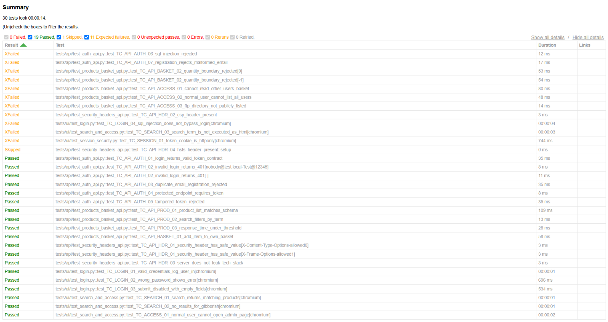
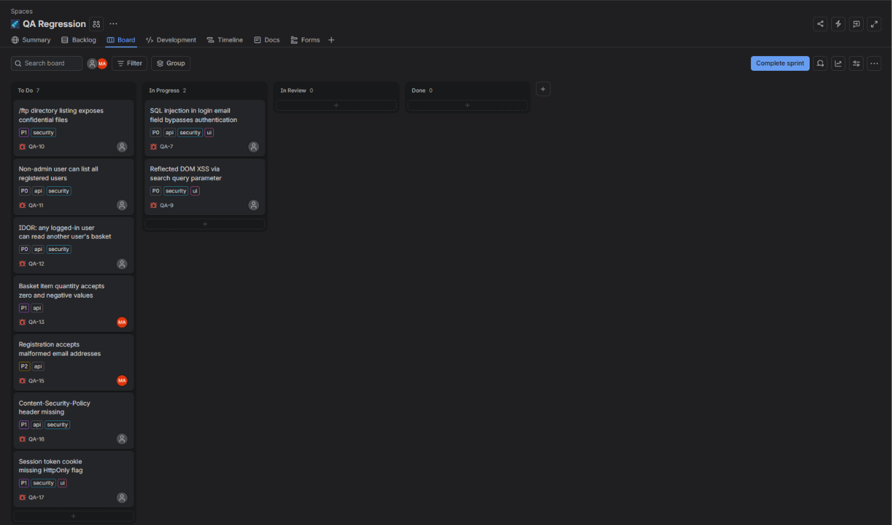

# QA Automation Suite: Web, API & Security Testing


End-to-end QA of [OWASP Juice Shop](https://github.com/juice-shop/juice-shop), a realistic e-commerce web app with real defects, using **Playwright (Python)**, **Pytest**, **REST API contract tests**, and a **Jira defect workflow** run in **GitHub Actions CI** on every push.

**Result:** 28 test cases (31 executions with parametrisation): **19 pass, 11 fail on 9 real defects, 1 skipped by design**, including a SQL-injection login bypass, DOM XSS, IDOR, broken access control, session-token exposure, a negative basket quantity, data exposure, and a missing CSP. Each defect is reproduced by hand, logged in Jira, and covered by a regression test.



## Defects found

| ID | Jira | Defect | Severity | Priority |
|---|---|---|---|---|
| [BUG-001](docs/bugs/BUG-001.md) | QA-7 | SQL injection in login bypasses authentication | Critical | P0 |
| [BUG-002](docs/bugs/BUG-002.md) | QA-9 | Reflected DOM XSS via search query | High | P0 |
| [BUG-003](docs/bugs/BUG-003.md) | QA-15 | Registration accepts malformed emails | Low | P2 |
| [BUG-004](docs/bugs/BUG-004.md) | QA-13 | Basket quantity accepts zero/negative values | High | P1 |
| [BUG-005](docs/bugs/BUG-005.md) | QA-12 | IDOR: user can read another user's basket | High | P0 |
| [BUG-006](docs/bugs/BUG-006.md) | QA-11 | Non-admin user can list all registered users | High | P0 |
| [BUG-007](docs/bugs/BUG-007.md) | QA-10 | `/ftp` directory listing exposes confidential files | Medium | P1 |
| [BUG-008](docs/bugs/BUG-008.md) | QA-16 | Content-Security-Policy header missing | Medium | P1 |
| [BUG-009](docs/bugs/BUG-009.md) | QA-17 | Session token cookie missing HttpOnly flag | High | P1 |

### Attack chain: three findings combine into account takeover

1. **BUG-002:** attacker-controlled script runs through the search box (DOM XSS)
2. **BUG-008:** no Content-Security-Policy is in place to block it
3. **BUG-009:** the script reads the session JWT from `document.cookie` because the cookie isn't HttpOnly

**Impact:** a single malicious link can steal a logged-in user's session. Fixing any one of the three breaks the chain; fixing all three is defence in depth.

### Jira sprint board



## Tech stack

| Area | Tools |
|---|---|
| UI automation | Playwright (Python), Page Object Model |
| API testing | Pytest, requests, JSON Schema |
| Reporting | pytest-html, JUnit XML |
| CI | GitHub Actions (P0 smoke, then full regression) |
| Defect tracking | Jira (Scrum board, sprint workflow) |

## Project structure

```
pages/          Page Object Model (login, search)
tests/ui/       Browser tests: login, search, admin access, session security
tests/api/      API tests: auth, products, basket, access control, security headers
schemas/        JSON Schemas for API contract checks
utils/          API client, test-data factory, schema helper
docs/           Test plan, test cases, bug reports, screenshots
.github/        CI workflow: smoke + regression + HTML report artifact
```

## Run locally

```bash
# 1. Start the app under test
docker run -d -p 3000:3000 bkimminich/juice-shop

# 2. Install
python -m venv .venv
.venv\Scripts\activate          # macOS/Linux: source .venv/bin/activate
pip install -r requirements.txt
playwright install chromium

# 3. Run
pytest                          # full regression
pytest -m p0                    # smoke: release blockers only
pytest -m security              # all security checks (UI + API)
pytest --headed -m ui           # watch the browser
pytest --html=reports/report.html --self-contained-html
```

## Test design

- **Priorities:** every test is tagged `p0` / `p1` / `p2`. P0 runs first in CI as a smoke gate.
- **Independent tests:** each test registers its own user through the API, so tests never share state and can run in any order.
- **Contract testing:** API responses are validated against JSON Schemas, not just status codes.
- **Negative and boundary cases:** invalid credentials, tampered JWTs, duplicate registration, quantity 0 / -1.
- **Security focus:** injection, IDOR, broken access control, data exposure, security headers, and session cookie flags.
- **Environment-aware:** checks that don't apply to the test environment (e.g. HSTS over plain HTTP) are skipped with a documented reason rather than reported as false bugs.

## How known bugs are handled

Open defects stay in the suite as:

```python
@pytest.mark.xfail(reason="BUG-001: SQL injection in login email field bypasses authentication")
```

with `xfail_strict = true` set globally in `pytest.ini`.

- The build stays green while a bug is known and tracked in Jira.
- When a fix lands, the test unexpectedly passes and **fails the build**, which forces someone to verify the fix, remove the marker, and close the ticket. This is how the regression verification step of STLC is enforced.

## STLC mapping

| Phase | Artifact |
|---|---|
| Test planning | [`docs/TEST_PLAN.md`](docs/TEST_PLAN.md) |
| Test case design | [`docs/TEST_CASES.md`](docs/TEST_CASES.md) |
| Execution | `pytest` + [CI workflow](.github/workflows/qa.yml) |
| Defect logging | [`docs/bugs/`](docs/bugs/) + Jira sprint board |
| Regression | `xfail` (strict) + CI on every push |

## Roadmap

- [ ] Checkout and payment flow tests
- [ ] Password reset flow
- [ ] Login rate-limiting check
- [x] Security headers (CSP, X-Frame-Options, X-Content-Type-Options)
- [x] Session cookie flags (HttpOnly)
- [ ] Desktop app testing with Playwright's Electron support